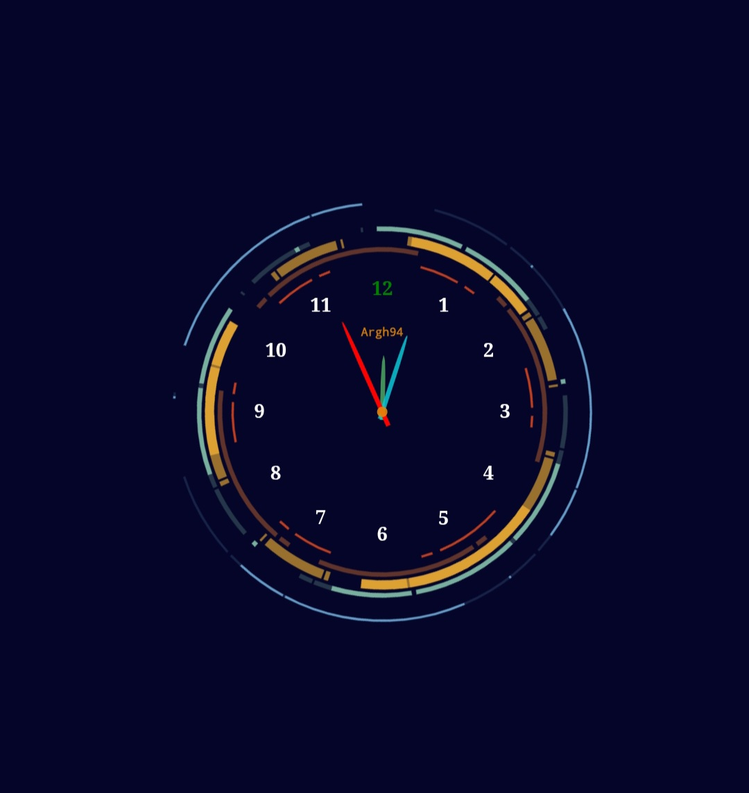

# ساعت آنالوگ (Analog Clock)

این پروژه یک ساعت آنالوگ ساده است که با استفاده از HTML، CSS و JavaScript طراحی شده است.

[مشاهده آنلاین ساعت](https://argh94.github.io/Analog-clock/)

## ویژگی‌ها

- نمایش زمان به صورت آنالوگ
- طراحی ساده و زیبا
- کاملاً واکنش‌گرا و قابل نمایش روی دستگاه‌های مختلف

## نحوه استفاده

برای مشاهده ساعت، کافی است به آدرس زیر مراجعه کنید:

[https://argh94.github.io/Analog-clock/](https://argh94.github.io/Analog-clock/)

همچنین می‌توانید پروژه را کلون کنید و به صورت محلی اجرا نمایید:

```sh
git clone https://github.com/argh94/Analog-clock.git
cd Analog-clock
```

سپس فایل `index.html` را در مرورگر خود باز کنید.

## مشارکت

خوشحال می‌شوم اگر پیشنهادی برای بهبود پروژه دارید یا باگ جدیدی پیدا کردید، از طریق Issues یا Pull Request‌ها اطلاع دهید.

## مجوز

این پروژه تحت لایسنس [MIT](LICENSE) منتشر شده است.
